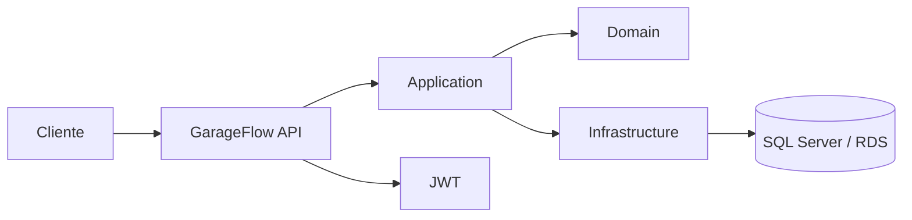

# fiap-garageflow-api

API principal do GarageFlow para clientes, veiculos, servicos, pecas e ordens de servico.

## Stack

- .NET 8 e ASP.NET Core Web API
- Entity Framework Core
- SQL Server
- JWT Bearer Authentication
- Docker e Kubernetes

## Pre-requisitos

- .NET 8 SDK para executar localmente
- Docker Desktop para executar a imagem
- SQL Server acessivel pela API
- Uma chave JWT configurada

## Configuracao

A aplicacao le configuracao pelo `appsettings.json` e por variaveis de ambiente do ASP.NET Core:

| Variavel | Obrigatoria | Descricao |
|---|---:|---|
| `ConnectionStrings__DefaultConnection` | Sim | String de conexao do SQL Server |
| `Jwt__Key` | Sim | Chave usada para assinar e validar tokens |
| `Jwt__Issuer` | Nao | Emissor; padrao `GarageFlowService` |
| `Jwt__Audience` | Nao | Audiencia; padrao `GarageFlowServiceClients` |

Nunca versione senhas ou a chave JWT. Em Kubernetes, esses dois primeiros valores devem ficar em um Secret.

## Execucao local

Na raiz deste repositorio:

```powershell
dotnet restore
$env:ConnectionStrings__DefaultConnection="Server=localhost,1433;Database=garage-flow;User Id=sa;Password=SuaSenha;Encrypt=True;TrustServerCertificate=True;"
$env:Jwt__Key="chave-local-com-pelo-menos-32-caracteres"
dotnet run --project src/GarageFlowService.API/GarageFlowService.API.csproj
```

A API executa as migrations do Entity Framework automaticamente durante a inicializacao.

Endpoints locais:

- Swagger: `https://localhost:7129/swagger` ou a URL exibida pelo `dotnet run`
- Health check: `/health`

## Testes

```powershell
dotnet test src/tests/GarageFlowService.Tests/GarageFlowService.Tests.csproj --nologo
```

## Docker

```powershell
docker build -t garageflow-api .
docker run --rm -p 8080:8080 `
    -e ConnectionStrings__DefaultConnection="Server=host.docker.internal,1433;Database=garage-flow;User Id=sa;Password=SuaSenha;Encrypt=True;TrustServerCertificate=True;" `
    -e Jwt__Key="chave-local-com-pelo-menos-32-caracteres" `
    garageflow-api
```

Swagger fica em `http://localhost:8080/swagger`.

## Deploy no Kubernetes

O workflow em `.github/workflows/cd.yml` publica a imagem no GHCR, configura o kubeconfig do EKS, atualiza o Secret da aplicacao e aguarda o rollout.

Secrets do GitHub:

- `AWS_ACCESS_KEY_ID`
- `AWS_SECRET_ACCESS_KEY`
- `DEFAULT_CONNECTION`
- `JWT_SECRET`

Variables do GitHub:

- `AWS_REGION`, normalmente `us-east-2`
- `EKS_CLUSTER_NAME`, nome do cluster EKS

## Arquitetura


