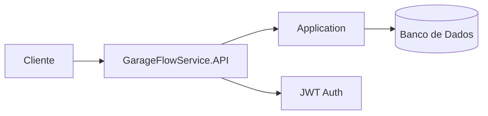

# fiap-garageflow-api

## Objetivo
Aplicação principal da oficina, responsável pela gestão de clientes, veículos, serviços, peças e ordens de serviço.

## Tecnologias
- .NET 8
- ASP.NET Core Web API
- EF Core
- SQL Server / PostgreSQL
- JWT
- Docker
- Kubernetes

## Execução local
```bash
dotnet restore
dotnet run --project src/GarageFlowService.API/GarageFlowService.API.csproj
```

## Docker
```bash
docker build -t garageflow-api .
docker run -p 8080:8080 garageflow-api
```

## Swagger
- http://localhost:8080/swagger

## Arquitetura

