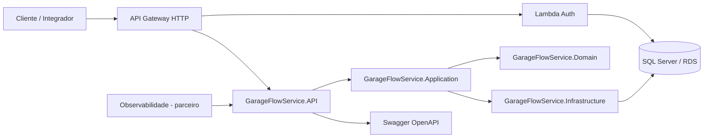
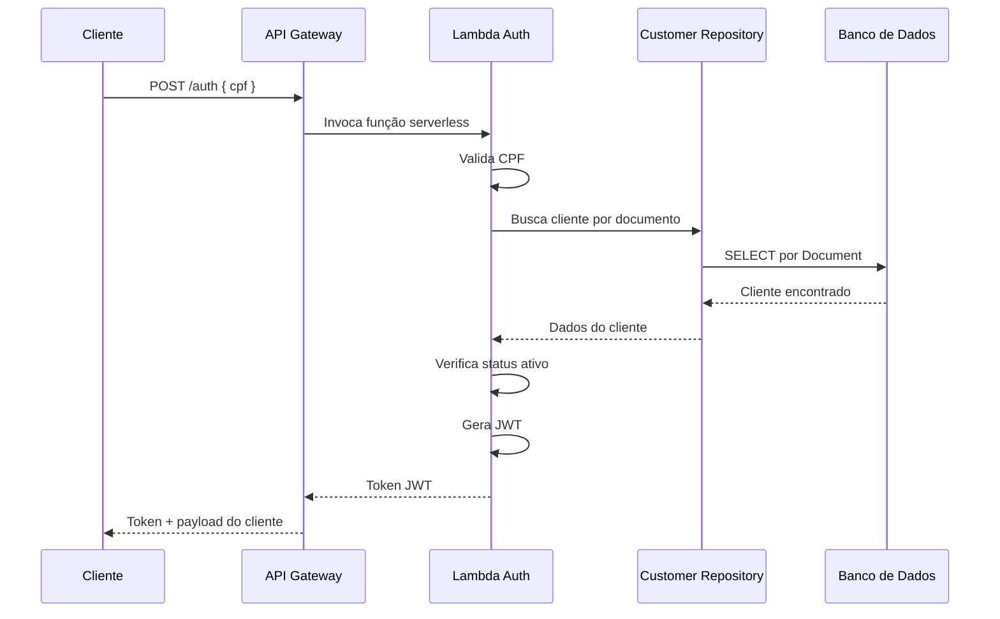
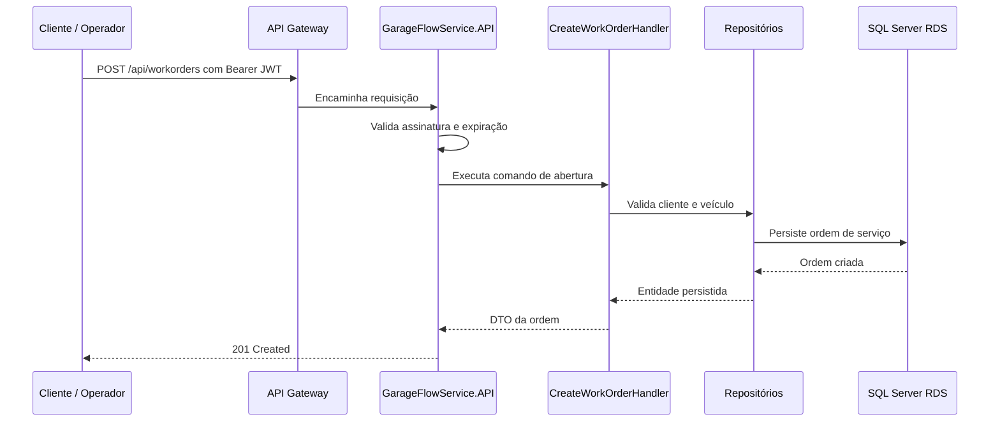
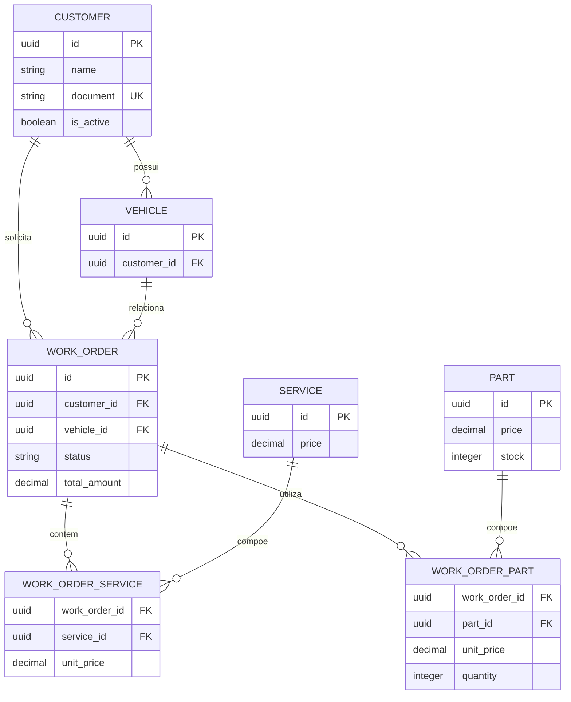

# Documentação de Arquitetura

## Visão geral

A aplicação GarageFlow Service foi projetada para suportar gestão de oficina mecânica em ambiente corporativo, priorizando segurança, organização em camadas, escalabilidade e infraestrutura automatizada.

## Objetivo

Disponibilizar uma API robusta para gestão de clientes, veículos, serviços, peças e ordens de serviço, mantendo autenticação segura com JWT e suporte a deploy em Kubernetes.

## Visão de componentes

## Fluxo principal

### Autenticação por CPF

### Abertura de ordem de serviço

## Decisões arquiteturais

### 1. Clean Architecture
A separação entre Domain, Application, Infrastructure e API mantém a lógica de negócio isolada da tecnologia.

### 2. JWT para autenticação
O acesso às rotas protegidas é autorizado por JWT validado pela API.

### 3. Persistência relacional
O banco relacional foi escolhido por oferecer consistência, consultas estruturadas e melhor aderência ao domínio da oficina.

### 4. Kubernetes e Terraform
A aplicação é implantada em ambiente Kubernetes, com infraestrutura provisionada por Terraform para automatização e reuso.

### 5. Escolha do banco de dados
O SQL Server gerenciado no Amazon RDS foi escolhido porque a aplicação utiliza .NET 8 e Entity Framework Core com o provider oficial `Microsoft.EntityFrameworkCore.SqlServer`. A escolha preserva transações ACID, constraints relacionais e consultas consistentes entre clientes, veículos, serviços, peças e ordens de serviço. O RDS privado reduz a superfície de exposição; somente workloads autorizados nas redes privadas devem acessar a porta 1433.

## Modelagem do banco

### Entidades principais
- Cliente
- Veículo
- Serviço
- Peça
- Ordem de Serviço
- Itens da Ordem de Serviço

### Relacionamentos principais
- Cliente possui vários veículos
- Ordem de Serviço pertence a um cliente e um veículo
- Ordem de Serviço contém vários serviços e peças

`CUSTOMER.document` possui índice único para impedir duplicidade de CPF. `WORK_ORDER` referencia obrigatoriamente cliente e veículo. As tabelas de associação representam os relacionamentos muitos-para-muitos e armazenam o preço praticado no momento da ordem.

## Requisitos de segurança

- uso de JWT
- rotas protegidas por [Authorize]
- validação de CPF
- verificação de status do cliente
- uso de credenciais centralizadas em variáveis de ambiente

## Observações

A documentação acima atende ao escopo ajustado do projeto, sem incluir monitoramento e observabilidade, que ficaram a cargo do colega responsável.
